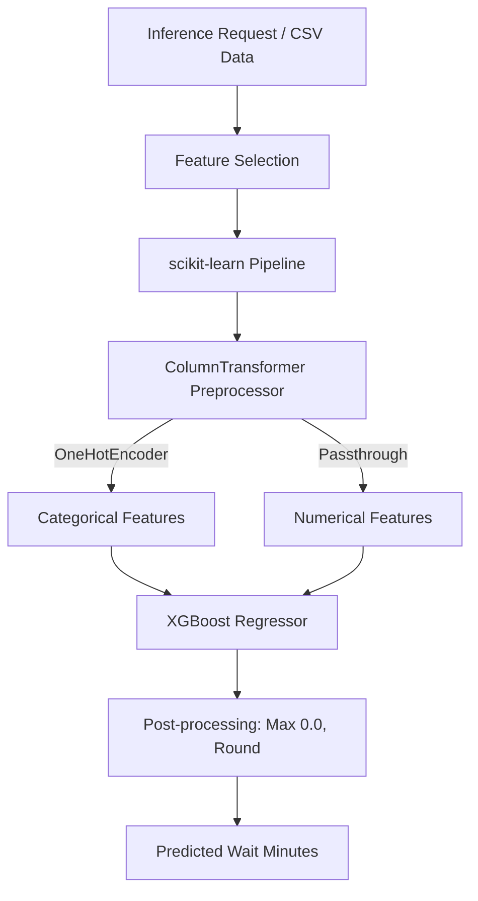

# Queue Care Machine Learning Service - Phase 1 (Training & Inference API)

This directory contains the machine learning components for the **Queue Care** patient-flow management platform. This service implements a supervised machine learning regression pipeline using **XGBoost** to dynamically predict actual patient waiting times, outperforming the existing static 15-minute rule-of-thumb heuristic.

---

## 🏗 System Architecture

The ML service is built as a modular pipeline integrating data validation, model training, evaluation, and a high-performance **FastAPI** web server for inference:



---

## 📂 Codebase Overview

- **[train.py](file:///e:/MAD%20-%20QUEUE%20CARE/Queue-Care-App/ml-service/train.py):** Main training pipeline. Validates training data, handles data leakage, performs train-test splitting, fits the model pipeline, evaluates baseline vs. model performance, and serializes artifacts.
- **[evaluate.py](file:///e:/MAD%20-%20QUEUE%20CARE/Queue-Care-App/ml-service/evaluate.py):** Standalone script to compute system-wide performance metrics on the full dataset.
- **[predict.py](file:///e:/MAD%20-%20QUEUE%20CARE/Queue-Care-App/ml-service/predict.py):** Command-line testing utility to run a sample prediction using a mocked input dictionary.
- **[main.py](file:///e:/MAD%20-%20QUEUE%20CARE/Queue-Care-App/ml-service/main.py):** FastAPI application serving the prediction engine over HTTP.
- **[requirements.txt](file:///e:/MAD%20-%20QUEUE%20CARE/Queue-Care-App/ml-service/requirements.txt):** Core dependencies for running the ML training pipeline and the web service.

---

## 📊 Dataset & Feature Catalog

The model is trained on synthetic data representing clinical scheduling and real-time patient queue metrics:
* **Location:** [queue_care_xgboost_training_dataset.csv](file:///e:/MAD%20-%20QUEUE%20CARE/Queue-Care-App/ml-service/data/queue_care_xgboost_training_dataset.csv)
* **Target Variable:** `actual_wait_minutes` (The total duration in minutes that a patient waited before consultation started).

### Feature Dictionary

| Feature Name | Type | Description | Example |
| :--- | :--- | :--- | :--- |
| `doctor_id` | Categorical | Unique identifier of the doctor (One-Hot Encoded) | `"DOC002"` |
| `specialization` | Categorical | Medical department or specialty (One-Hot Encoded) | `"Cardiology"` |
| `day_of_week` | Numerical | Day index: `0` = Monday, ..., `6` = Sunday | `5` (Saturday) |
| `appointment_hour` | Numerical | Scheduled hour of appointment (24h format) | `10` |
| `appointment_minute` | Numerical | Scheduled minute of appointment | `30` |
| `queue_position` | Numerical | Assigned token position in the doctor's list | `8` |
| `patients_ahead` | Numerical | Number of booked patients ahead in line | `7` |
| `checked_in_ahead` | Numerical | Number of patients ahead who have physically checked in | `5` |
| `current_queue_length` | Numerical | Total number of patients currently waiting in line | `6` |
| `slot_booked_count` | Numerical | Total appointments booked in the current slot block | `8` |
| `completed_consultations_today` | Numerical | Number of consultations already finished by the doctor today | `2` |
| `doctor_avg_consultation_minutes` | Numerical | Historical average consultation session length for the doctor | `20.0` |
| `doctor_avg_wait_minutes` | Numerical | Historical average waiting time for patients under this doctor | `32.0` |

> [!WARNING]
> **Data Leakage Protection:**
> To protect the pipeline against data leakage, columns such as `actual_consultation_duration_minutes` are strictly excluded from the feature set. This is because consultation duration is unknown at the moment prediction occurs (which is when the patient books or checks in).

---

## ⚡ Inference API Reference

The FastAPI server provides endpoints to perform real-time wait time estimations.

### 1. Health Check
* **Endpoint:** `GET /health`
* **Response:**
```json
{
  "status": "healthy",
  "model_loaded": true
}
```

### 2. Predict Wait Time
* **Endpoint:** `POST /predict`
* **Request Headers:** `Content-Type: application/json`
* **Request Payload Schema:**
```json
{
  "doctor_id": "DOC002",
  "specialization": "Cardiology",
  "day_of_week": 5,
  "appointment_hour": 10,
  "appointment_minute": 30,
  "queue_position": 8,
  "patients_ahead": 7,
  "checked_in_ahead": 5,
  "current_queue_length": 6,
  "slot_booked_count": 8,
  "completed_consultations_today": 2,
  "doctor_avg_consultation_minutes": 20.0,
  "doctor_avg_wait_minutes": 32.0
}
```
* **Response Payload Schema:**
```json
{
  "predicted_wait_minutes": 26.4
}
```

### Example Request using `curl`:
```bash
curl -X POST "http://127.0.0.1:8000/predict" \
     -H "Content-Type: application/json" \
     -d '{
       "doctor_id": "DOC002",
       "specialization": "Cardiology",
       "day_of_week": 5,
       "appointment_hour": 10,
       "appointment_minute": 30,
       "queue_position": 8,
       "patients_ahead": 7,
       "checked_in_ahead": 5,
       "current_queue_length": 6,
       "slot_booked_count": 8,
       "completed_consultations_today": 2,
       "doctor_avg_consultation_minutes": 20.0,
       "doctor_avg_wait_minutes": 32.0
     }'
```

---

## 🚀 Setup & Execution Guide

### Prerequisites
Make sure you have Python 3.9+ installed.

### 1. Environment Configuration
Navigate to the `ml-service` directory, set up a virtual environment, and install dependencies:
```bash
cd ml-service
python -m venv venv
# On Windows (cmd/PowerShell):
venv\Scripts\activate
# On macOS/Linux:
source venv/bin/activate

pip install -r requirements.txt
```

### 2. Train the Model Pipeline
Run the training script to execute cleaning, preprocessing, training, evaluation, and saving steps:
```bash
python train.py
```
This generates the following serialized artifacts:
* `models/queue_wait_pipeline.joblib`: The scikit-learn Pipeline (composed of categorical encoding transformers and the fitted `XGBRegressor`).
* `results/metrics.json`: Summary comparison of baseline vs. XGBoost performance.
* `results/predictions.csv`: Model predictions mapped alongside baseline predictions on the test set.
* `results/feature_importance.csv`: Ordered feature weights computed by XGBoost.

### 3. Run Standalone Evaluation
Compare predictions and calculate metrics on the entire dataset:
```bash
python evaluate.py
```

### 4. Run CLI Sample Prediction
Test local prediction capabilities using mocked data details:
```bash
python predict.py
```

### 5. Launch the FastAPI API Server
Start the development server:
```bash
python main.py
```
The server will bind to `127.0.0.1:8000`. You can access the auto-generated Swagger documentation at `http://127.0.0.1:8000/docs`.

---

## 🛠 Production Roadmap & Best Practices

> [!IMPORTANT]
> **Chronological Train/Test Splits**
> In developmental phases using synthetic static datasets, random splitting is sufficient. However, for production deployments using real-time database queries, **always split training/testing slices chronologically** (e.g., training on months 1–4, testing on month 5) to prevent future data leakage.

### Phase 2 & 3 Development Roadmap:
1. **Supabase Direct Integration:** Create a service worker to pull historical consultation logs directly from the Supabase PostgreSQL database periodically.
2. **Automated Pipeline Retraining:** Schedule an orchestration task (e.g., via GitHub Actions or Cron) to fetch fresh database logs, execute [train.py](file:///e:/MAD%20-%20QUEUE%20CARE/Queue-Care-App/ml-service/train.py), and upload the new joblib pipeline artifact.
3. **Inference API Deployment:** Deploy the FastAPI application as a Dockerized container on cloud providers, accessible to the primary Go backend service.
